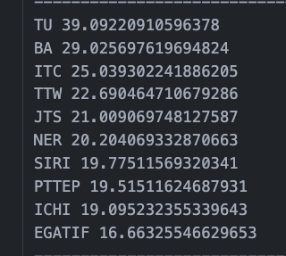
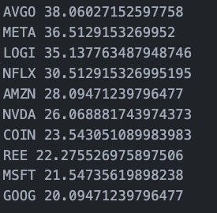

# Stock, Fund and crypto analysis bot
##### all using Python 3.9 version
    - You can run install_lib.sh file for install all library
##### detail:
    - More flexible
    - Easy to use
##### how to config bot
###### config indicator parameter has two options.
    - long_indicator file for long-term data analysis
    - short_indicator file for short-term data analysis
###### config to using indicators in config/config.json.
    - The parameter mode includes three modes.:
        - stock
        - fund
        - crypto
    - fetch_newdata parameter parameter determines whether to pull data on the first attempt or not.
    - len_data parameter specifies the number of rows in the data.
###### config select stock name in config/list_stock/stock_config.json
    - currenly support fund, stock and cryptocurrency

###### Example of Final Analysis Results
###### SET

###### USA

